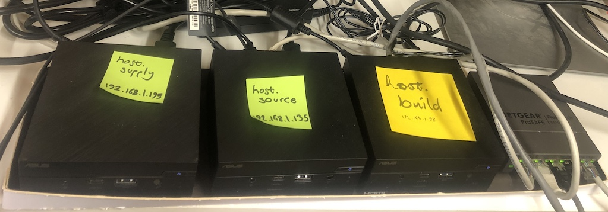
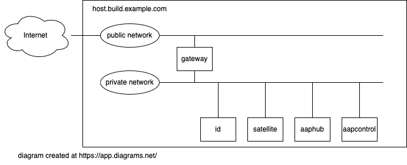

= Ansible playbook for turning a PC into a set of build VMs

[NOTE] 
====
Under construction. Sections marked with !!! and ??? are notes to self. 
Like this one.

!!! 
Write one command to kick off the build of everything.

Use one certificate CA, not three.

Build gateway and satellite. 

Use satellite to build the rest. 
====

Ansible helps me assemble my home lab. 
This playbook turns a PC running RHEL 9 into a hypervisor running a pile-load (that's the technical term) of Virtual Machines. 

== home-lab-1 is a cluster of three PCs

I used three PCs to build a reasonably complicated network.

Each PC has a purpose.
One PC acts as an application builder and manager. It manages the building of things.  Another PC provides sources of data for this builder, and one is supplied by the builder.

* *source* PC is a home for applications that provide data sources to Red Hat software, such as third party data vaults, user directories and code stores.
* *build* PC holds Red Hat software, such as AAP, IdM and Satellite.
* *supply* PC is where things are collected, such as logs, metrics, and mail, and where workloads run. Customer services are built on this machine.  

== built by Ansible

Each machine has its own Ansible playbook.
These create a network of virtual machines on three fresh RHEL 9 hosts.

* https://github.com/nickhardiman/ansible-playbook-source
* https://github.com/nickhardiman/ansible-playbook-build
* https://github.com/nickhardiman/ansible-playbook-supply

Two supporting collections so far. 

* https://github.com/nickhardiman/ansible-collection-platform
* https://github.com/nickhardiman/ansible-collection-app

== hardware

I use the playbook on this PC. 

* 64GB RAM 
* 1TB storage
* 4 core CPU

It's a lot of memory, and yet it isn't enough. 
It's never enough. 

== OS (Operating System)

I use the playbook on this OS. 

RHEL 9, fresh minimal install

== the KVM/QEMU hypervisor 

A bootstrap shell script kicks off the install. 
See instructions in 
https://github.com/nickhardiman/ansible-playbook-build/blob/main/bootstrap.sh[bootstrap.sh].

== virtual network

Each machine has two networks. 
One is for public access from elsewhere in the network. 
The other is private, for all the VMs.

* 192.168.10.0/24 - public network on the source PC
* 192.168.11.0/24 - private network on the source PC
* 192.168.12.0/24 - public network on the build PC
* 192.168.13.0/24 - private network on the build PC
* 192.168.14.0/24 - public network on the supply PC
* 192.168.15.0/24 - private network on the supply PC

== VMs (Virtual Machines)

Each machine runs a bunch of VMs. 
They can't all fit on one of these little PCs - there's not enough memory.
These VMs are on the build machine.

 

The https://github.com/nickhardiman/ansible-playbook-build/blob/main/group_vars/all/main.yml[defaults file] defines a lot of values. 
For instance, most 
MAC addresses are set to ** 52:54:00:13:00:* **,  and 
IPv4 addresses are set to ** 192.168.13.* **. 

.guests attached to bridges
[%header,format=csv]
|===
name,         interface, MAC,               IP,              domain
*netpublic0*,    *brpublic0*,  52:54:00:12:00:01, (IPv4 address chosen by the home router),     home
host,               enp1s0,    52:54:00:12:00:02 (!!! failed to override real address), (another address from the home router's pool),     home
gateway,            enp1s0,    52:54:00:12:00:03, (another address from the home router's pool),     home

*netbuild0*,     *brbuild0*,   52:54:00:13:00:01, 192.168.13.1,   build.example.com
       ,           ,           52:54:00:13:00:02, 192.168.13.2,   build.example.com
gateway,            enp2s0,    52:54:00:13:00:03, 192.168.13.3,   build.example.com
id,                 enp1s0,    52:54:00:13:00:04, 192.168.13.4,   build.example.com
satellite,          enp1s0,    52:54:00:13:00:05, 192.168.13.5,   build.example.com
aaphub,             enp1s0,    52:54:00:13:00:06, 192.168.13.6,   build.example.com
aapcontrol,         enp1s0,    52:54:00:13:00:07, 192.168.13.7,   build.example.com
dev,                enp1s0,    52:54:00:13:00:08, 192.168.13.8,   build.example.com
test,               enp1s0,    52:54:00:13:00:09, 192.168.13.9,   build.example.com
|===

== applications 

Each VM runs a set of services that support my home lab. 

. *gateway* hosts Bind, Squid, Postfix, NFS, haproxy, cockpit
. *satellite* VM provisioning, RPM repos, maybe DHCP
. *aapcontrol* Ansible Automation Platform v2 Controller
. *aaphub* Ansible Private Automation Hub
. *id* hosts Red Hat IDM (LDAP, CA, DNS)
. *dev* is the toolshed.
. *test* 

== cheat sheet

=== PC and OS

Start with a machine running RHEL 9. 
Use your free developer account to grab the installer ISO from https://access.redhat.com/downloads.
A fresh minimal install is fine. 

Only tested on a box with one ethernet interface, plugged into the network.

=== edit the bootstrap script

Script 
https://github.com/nickhardiman/ansible-playbook-build/blob/main/bootstrap.sh[bootstrap.sh] 
sets up everything on a freshly installed host. 

* Log into the hypervisor machine.
* Download the script.

[source,shell]
....
curl -O https://raw.githubusercontent.com/nickhardiman/ansible-playbook-build/main/bootstrap.sh
....

* Read the script 
* Follow the instructions and edit the script.

